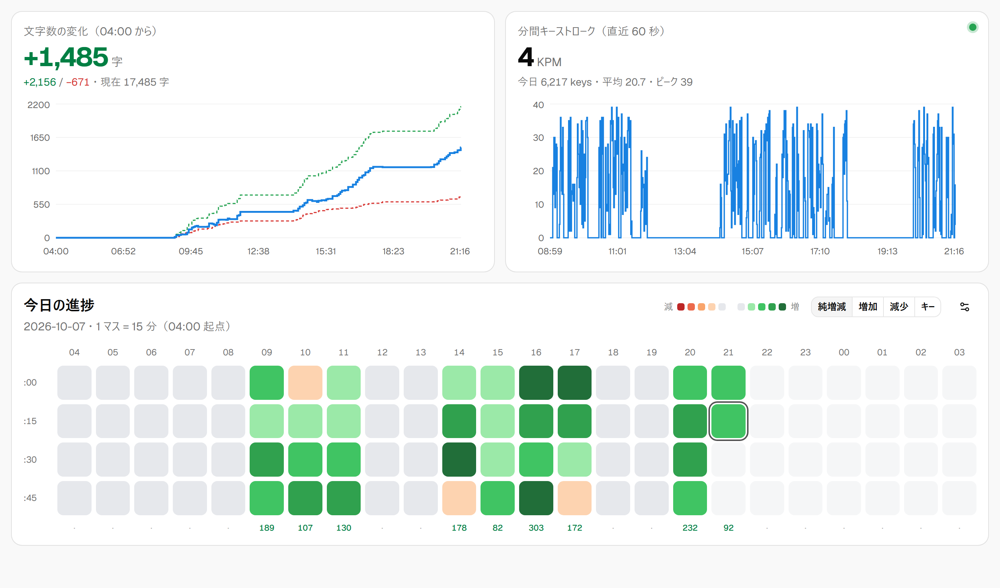

# Keystroke and Character Count Heatmap

執筆の進み具合を記録する Windows 向けのデスクトップアプリです（Tauri 2 + React + shadcn/ui）。

<picture>
  <source media="(prefers-color-scheme: dark)" srcset="docs/screenshot-dark.png">
  
</picture>

<sub>※ 画面はデモデータです。OS のダークモードにも追従します。</sub>

- **分間キーストローク (KPM)** … 指定したアプリ（例: `Code.exe`、`WINWORD.EXE`）が前面にある間だけキー入力を数えます。直近 60 秒の値と、1 分ごとの推移グラフを表示します。
- **文字数の累計変化** … 指定したファイルを定期的に読み、前回の内容と **1 文字ずつ比べて（diff）** 増えた分・減った分を別々に積み上げます。純増減 = 増加 − 減少 です。
- **15 分ごとのヒートマップ** … GitHub の「草」のように、その日の 純増減／増加／減少／キー数 を色の濃さで表示します。
- **日付の切り替え時刻** … 1 日の始まりを設定できます（初期値 04:00）。深夜の作業も「その日」の分として数えられます。

---

## インストール

### 1. インストーラをダウンロード

[**Releases ページ**](https://github.com/0tsu-0w0/Keystroke-and-Character-Count-Heatmap/releases/latest) から、最新版の次のファイルをダウンロードします。

| ファイル | 内容 |
|---|---|
| `Progress.Tracker_x.y.z_x64-setup.exe` | **通常はこちら**。管理者権限なしでインストールできます |
| `Progress.Tracker_x.y.z_x64_en-US.msi` | MSI 版（社内配布などで MSI が必要な場合） |

### 2. インストーラを実行

ダウンロードした `…-setup.exe` をダブルクリックし、画面の案内に従います。

> **「Windows によって PC が保護されました」と表示された場合**
> このアプリにはコード署名がないため、初回に SmartScreen の警告が出ることがあります。
> 「**詳細情報**」→「**実行**」の順にクリックすると続行できます。

WebView2 ランタイムが入っていない PC では、インストーラが自動で取得します（Windows 10/11 の多くの PC には最初から入っています）。

### 3. 初期設定

1. スタートメニューから **Progress Tracker** を起動します。
2. 画面右下（ヒートマップ右上）の **歯車アイコン** を押して設定を開きます。
3. 次の項目を設定して「保存」を押します。

| 設定 | 説明 |
|---|---|
| 計測対象のアプリ | キー入力を数えるアプリの実行ファイル名。「最近前面にあったアプリ」から選ぶこともできます |
| 文字数を数えるファイル | 原稿ファイル（`.txt` `.md` `.tex` など）。「参照」から選べます |
| 空白も数えない | オンにするとスペース・タブを数えません（改行は常に数えません） |
| 日付を切り替える時刻 | この時刻を境に「今日」が切り替わります |
| ファイル確認の間隔 | ファイルを読み直す間隔（秒） |

対象アプリが前面にあると、KPM カード右上の丸が **緑** になり、計測中であることが分かります。

### アンインストール

「設定」→「アプリ」→「インストールされているアプリ」から **Progress Tracker** をアンインストールします。
記録データを消したい場合は、下記のデータフォルダも削除してください。

---

## データの保存先

`%APPDATA%\com.progresstracker.app\`

| ファイル | 内容 |
|---|---|
| `settings.json` | 設定 |
| `days\YYYY-MM-DD.json` | 1 日分の記録（ファイル変更ごとの増減と、1 分ごとのキー数） |
| `snapshot.json` | 最後に読んだファイルの内容。アプリを閉じていた間の変化も、同じ日のうちなら次に起動したときに数えます |

キー入力は「何回押されたか」の回数だけを記録します。**どのキーを押したか（入力内容）は記録しません。**

## 注意事項

- 管理者権限で動いているアプリが前面にあるときは、Windows の仕様によりキー入力を検知できません。
- ファイルは UTF-8 として読みます（BOM 付き・CRLF にも対応）。Shift_JIS のファイルには対応していません。
- 数え方の設定（空白を数えるか）を変えると、その時点の内容を基準にして数え直します。
- 現在は Windows のみを対象にしています。

---

## ソースからビルドする

### 必要なもの

- [Node.js](https://nodejs.org/) 20 以上
- [Rust](https://rustup.rs/)（stable-msvc）
- [Microsoft C++ Build Tools](https://visualstudio.microsoft.com/visual-cpp-build-tools/)（「C++ によるデスクトップ開発」ワークロード）

詳しくは [Tauri の前提条件](https://tauri.app/start/prerequisites/) を参照してください。winget を使う場合は次のとおりです。

```powershell
winget install --id Rustlang.Rustup -e
winget install --id Microsoft.VisualStudio.2022.BuildTools -e --override "--passive --add Microsoft.VisualStudio.Workload.VCTools --includeRecommended"
```

### 開発・ビルド

```bash
npm install
npm run tauri dev      # 開発モードで起動
npm run tauri build    # インストーラを作成（src-tauri/target/release/bundle/ に出力）
```

`npm run dev` だけを実行するとブラウザでも開けます。その場合はデモデータが表示されます。

> **LNK1104 エラーが出る場合**: プロジェクトのパスが長すぎて、ビルド成果物のパスが Windows の 260 文字制限を超えています。
> 浅い場所（例: `C:\src\`）に置くか、環境変数 `CARGO_TARGET_DIR` に短いパスを指定してください。

### リリースの作り方

`v` で始まるタグを push すると、GitHub Actions（[`.github/workflows/release.yml`](.github/workflows/release.yml)）がインストーラをビルドし、Releases に公開します。

```bash
git tag v0.1.0
git push origin v0.1.0
```

バージョン番号は `package.json`、`src-tauri/Cargo.toml`、`src-tauri/tauri.conf.json` の 3 か所をそろえてください。

## 構成

| パス | 内容 |
|---|---|
| `src-tauri/src/tracker.rs` | キーボードフック、前面アプリの監視、ファイル監視、日ごとの記録の保存 |
| `src-tauri/src/diff.rs` | 文字単位の diff（増加・減少の計算） |
| `src-tauri/src/model.rs` | 設定・記録のデータ型、論理日付の計算 |
| `src/components/` | 文字数カード、KPM カード、ヒートマップ、設定ダイアログ |

## ライセンス

[MIT License](LICENSE)
